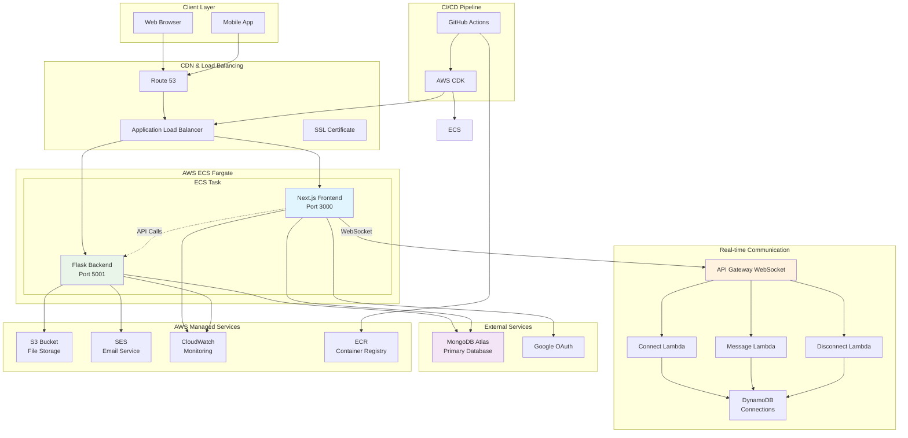
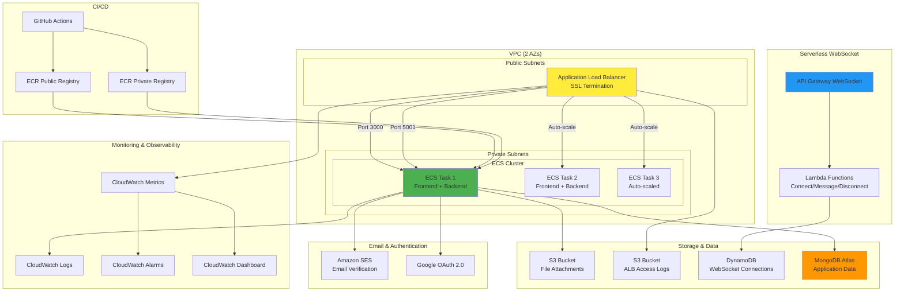
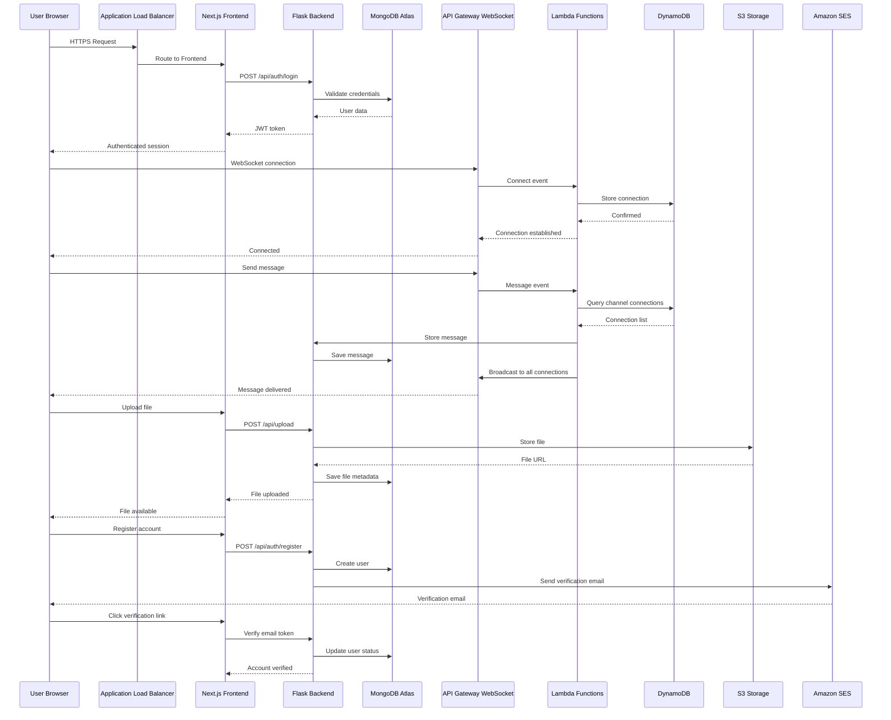
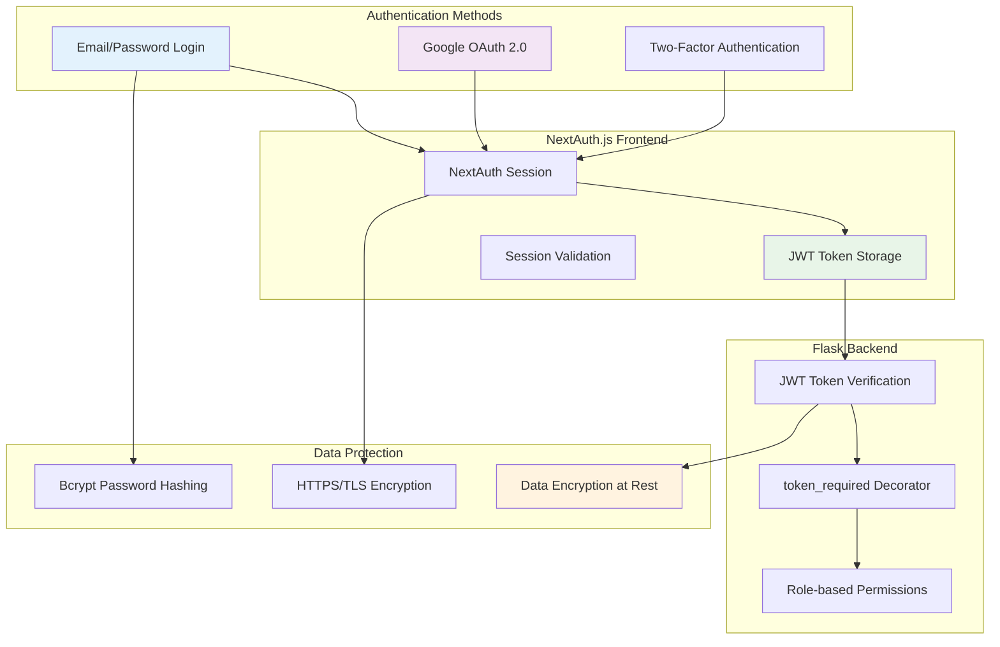
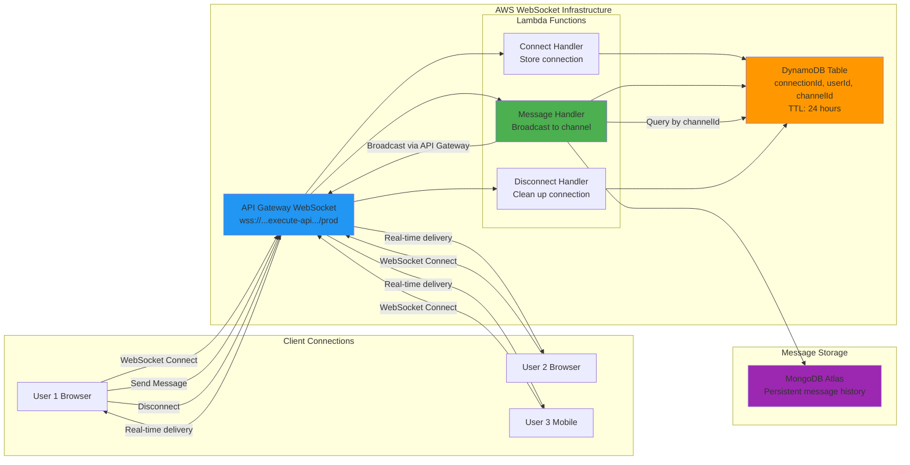
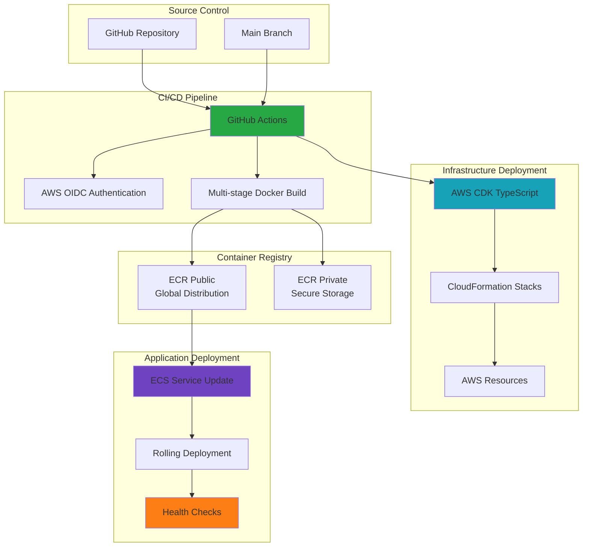

# 🧠 ConnectBest Chat

The **ConnectBest Chat Application** is a full-stack real-time chat platform with Next.js frontend and Flask backend, containerized and deployed to **AWS ECS Fargate** with multi-container architecture, HTTPS security, and secure credential management.

This application provides secure team communication with real-time messaging, file sharing, and authentication, deployed automatically using **GitHub Actions + AWS CDK** for infrastructure as code.

---

## 🏗️ System Architecture

### **Technology Stack**
- **Frontend**: Next.js 15 (App Router), TypeScript, Tailwind CSS, NextAuth.js
- **Backend**: Flask (Python 3.8+), Socket.IO, PyMongo
- **Database**: MongoDB Atlas (Cloud)
- **Real-time**: AWS Lambda + API Gateway WebSocket
- **Authentication**: NextAuth with Credentials + Google OAuth, JWT tokens, 2FA support
- **Infrastructure**: AWS ECS Fargate, Application Load Balancer, CloudWatch
- **Storage**: S3 (files), SES (email)
- **Deployment**: Docker containers → AWS ECR Public → AWS ECS via CDK

### **High-Level Architecture**



### **AWS Infrastructure Components**



### **Data Flow Architecture**



### **Authentication & Security Flow**



### **WebSocket Real-time Architecture**



### **Key Architecture Benefits**

| Feature | Implementation | Benefit |
|---------|---------------|---------|
| **High Availability** | Multi-AZ deployment, auto-scaling (1-3 tasks) | 99.9%+ uptime, fault tolerance |
| **Serverless Real-time** | Lambda + API Gateway WebSocket | Cost-effective, unlimited scale |
| **Container Orchestration** | ECS Fargate with ALB | Zero server management, blue-green deployments |
| **Stateless Design** | JWT tokens, external MongoDB | Horizontal scaling, session persistence |
| **CDN Integration** | CloudFront-ready static assets | Global performance optimization |
| **Security by Design** | HTTPS, JWT, OAuth, role-based access | Enterprise-grade security |
| **Observability** | CloudWatch metrics, logs, alarms | Proactive monitoring, debugging |
| **Cost Optimization** | Pay-per-use Lambda, efficient containers | Optimized for startup/small teams |

### **Infrastructure as Code**



### **Monitoring & Operations**

The application includes comprehensive observability through:

- **📊 Operations Dashboard** (`/ops`): Real-time system health, WebSocket monitoring, AWS integration
- **🏥 Health Checks**: Application health endpoints with git build information
- **📈 CloudWatch Metrics**: CPU, memory, request count, error rates, latency
- **🚨 CloudWatch Alarms**: Proactive alerting for high error rates, latency, low healthy hosts
- **📝 Centralized Logging**: ECS container logs, ALB access logs, Lambda function logs
- **🔍 WebSocket Health Monitoring**: Connection status, protocol validation, troubleshooting guidance

#### **Key Monitoring URLs**
- Application Health: `https://chat.connect-best.com/api/health`
- Operations Dashboard: `https://chat.connect-best.com/ops` (admin access required)
- CloudWatch Dashboard: Auto-generated URL in deployment outputs
- ALB Access Logs: S3 bucket with HTTP status codes and performance data

---

## 🧰 Local Development

### Prerequisites
- Docker 24+  
- Python 3.12+ (optional, for manual testing)
- AWS CLI (optional, for debugging)

### Run Locally
```bash
docker build -t connectbest-chat:dev .
docker run -p 8080:8080 connectbest-chat:dev
```

---

## 🗂 Project Structure

The repository follows a monorepo-style layout, containing the frontend (Next.js), backend (Flask), and WebSocket service. Below is an overview of the main folders and their purpose:
```
chat/
├── app/                       # Next.js App Router (frontend UI + API routes)
│   ├── (auth)/                # Authentication pages (login, register, forgot, verify-email)
│   ├── (app)/                 # Protected pages (chat, profile, admin, ops)
│   ├── api/                   # API route handlers (mostly proxies to Flask backend)
│   └── globals.css            # Global styles
│
├── components/                # React components
│   ├── chat/                  # Chat UI (sidebar, messages, threads, emoji picker, uploads)
│   ├── providers/             # Global context providers (auth, socket, query, theme)
│   └── ui/                    # Reusable UI components (buttons, inputs, modals, avatars)
│
├── lib/                       # Frontend utilities and helpers
│   ├── api.ts                 # Axios client wrapper
│   ├── apiConfig.ts           # API configuration and endpoints
│   ├── auth.ts                # Authentication helpers
│   └── mongodb.ts             # MongoDB client (mock for frontend)
│
├── backend/                   # Flask backend service
│   ├── app.py                 # Main Flask entrypoint
│   ├── config.py              # App configuration + environment variables
│   ├── init_db.py             # Database initialization script
│   ├── routes/                # API route modules (auth, channels, messages, upload, etc.)
│   ├── models/                # MongoDB models (users, channels, messages, threads, files, etc.)
│   ├── utils/                 # Helpers (auth, email, validators, 2FA, OAuth)
│   └── scripts/               # Schema export, migration, comparison tools
│
├── websocket-api/             # AWS WebSocket API (SAM + Lambda)
│   ├── template.yaml          # WebSocket infrastructure template
│   └── src/handlers/          # Lambda handlers for connect/disconnect/message
│
├── .github/workflows/         # CI/CD pipelines (build, publish, OpenAPI lint)
│
├── Dockerfile                 # Multi-stage Docker build (Next.js → standalone server)
├── docker-compose.yml         # Optional local orchestration for backend + DB
├── next.config.js             # Next.js configuration
├── tailwind.config.js         # TailwindCSS configuration
├── tsconfig.json              # TypeScript config
└── README.md                  # Project root documentation
```

This structure enables full-stack development inside a single repository while maintaining clear separation between frontend, backend, and infrastructure layers.

---

## 📚 Documentation

Complete documentation is available in the [`docs/`](docs/) directory, organized by topic:

- **🚀 [Setup & Getting Started](docs/setup/)** - Installation, configuration, and first-time setup guides
- **🏗️ [Architecture & Design](docs/architecture/)** - Technical architecture, database design, and component structure
- **🔐 [Authentication & Security](docs/authentication/)** - JWT, OAuth, 2FA, and security implementation
- **🛠️ [Development](docs/development/)** - Testing, debugging, schema migration, and development workflows
- **🚀 [Deployment](docs/deployment/)** - Production deployment guides and checklists
- **📡 [API Documentation](docs/api/)** - Complete API reference and endpoint specifications
- **📊 [Diagrams](docs/diagrams/)** - Visual architecture diagrams and flow charts

### Quick Links
- **New Developer?** Start with [docs/setup/MONOREPO_README.md](docs/setup/MONOREPO_README.md)
- **Backend Setup?** Follow [docs/setup/backend-readme.md](docs/setup/backend-readme.md)
- **Deployment?** Check [docs/deployment/DEPLOYMENT_GUIDE.md](docs/deployment/DEPLOYMENT_GUIDE.md)
- **API Reference?** See [docs/api/BACKEND_API_REQUIREMENTS.md](docs/api/BACKEND_API_REQUIREMENTS.md)
