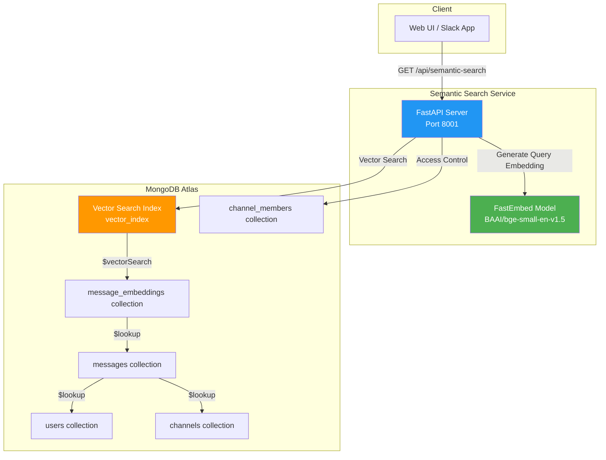
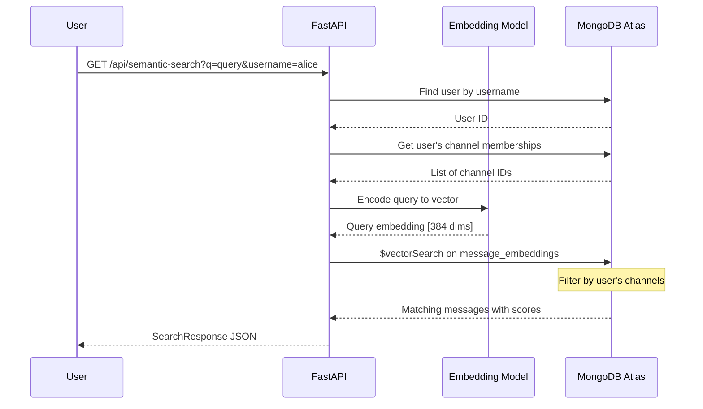

# Semantic Search API

Real-time semantic search service for Slack messages using MongoDB Atlas Vector Search.

## Overview

This standalone API provides instant semantic search capabilities for Slack messages. It's designed for typeahead/autocomplete functionality, returning relevant results as users type each character.

## Architecture



## Files

| File | Description |
|------|-------------|
| `api.py` | Main FastAPI application with semantic search endpoint |

## API Endpoints

### GET `/api/semantic-search`

Search Slack messages semantically with user access control.

**Query Parameters:**

| Parameter | Type | Required | Default | Description |
|-----------|------|----------|---------|-------------|
| `q` | string | Yes | - | Search query (min 1 char) |
| `username` | string | Yes | - | Username for access control |
| `limit` | int | No | 10 | Max results (1-50) |

**Example Request:**
```bash
curl "http://localhost:8001/api/semantic-search?q=kubernetes%20deployment&username=alice&limit=5"
```

**Example Response:**
```json
{
  "query": "kubernetes deployment",
  "results": [
    {
      "message_id": "msg-123",
      "text": "We should use rolling deployments for the k8s cluster...",
      "author_name": "Bob Smith",
      "channel_name": "devops",
      "created_at": "2024-01-15T10:30:00Z",
      "score": 0.89
    }
  ],
  "count": 1,
  "search_time_ms": 45.2
}
```

### GET `/health`

Health check endpoint.

**Response:**
```json
{
  "status": "healthy",
  "service": "semantic-search",
  "database": "connected",
  "model": "all-MiniLM-L6-v2"
}
```

## How It Works



## Environment Variables

| Variable | Required | Default | Description |
|----------|----------|---------|-------------|
| `MONGO_URI` | Yes | - | MongoDB Atlas connection string |
| `EMBEDDING_MODEL` | No | `BAAI/bge-small-en-v1.5` | FastEmbed model name |

## Running Locally

```bash
# Install dependencies
pip install fastapi uvicorn pymongo fastembed

# Set environment variables
export MONGO_URI="mongodb+srv://..."

# Run the server
python api.py
# or
uvicorn api:app --host 0.0.0.0 --port 8001 --reload
```

## Database Requirements

### Collections

1. **message_embeddings** - Vector embeddings for messages
   - `message_id`: Reference to messages collection
   - `embedding`: 384-dimensional vector
   - Requires `vector_index` Atlas Search index

2. **messages** - Slack messages
   - `id`, `text`, `author_id`, `channel_id`, `created_at`

3. **users** - User profiles
   - `id`, `username`, `display_name`

4. **channels** - Channel metadata
   - `id`, `name`

5. **channel_members** - Channel membership for access control
   - `user_id`, `channel_id`

### Vector Search Index

Create this index on `message_embeddings` collection:

```json
{
  "name": "vector_index",
  "type": "vectorSearch",
  "definition": {
    "fields": [
      {
        "type": "vector",
        "path": "embedding",
        "numDimensions": 384,
        "similarity": "cosine"
      }
    ]
  }
}
```

## Performance

- **Response Time**: ~50-100ms for typical queries
- **Embedding Model**: BAAI/bge-small-en-v1.5 (384 dimensions)
- **numCandidates**: 200 for quality results
- **Post-filtering**: By user's accessible channels

## Notes

- This is a **standalone service** separate from the AI Agent
- Uses `fastembed` library (same as the AI Agent - lightweight, no PyTorch)
- Designed for high-frequency typeahead calls
- GET-only endpoint enables HTTP caching
