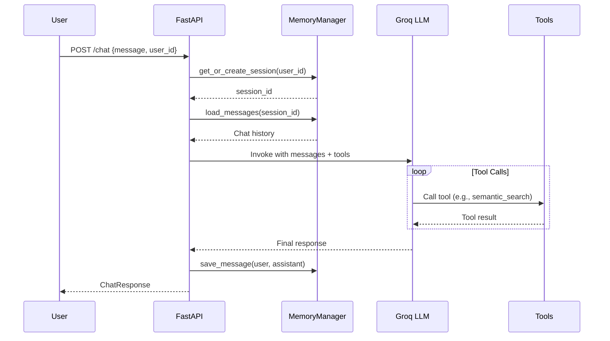
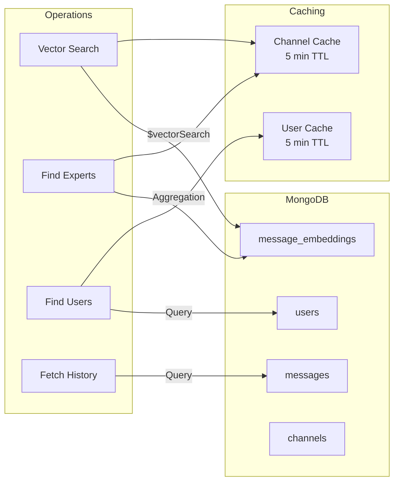
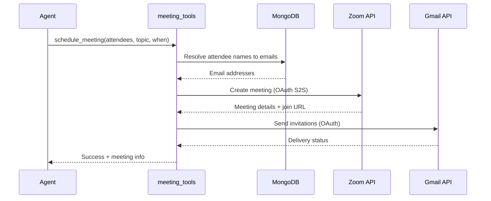
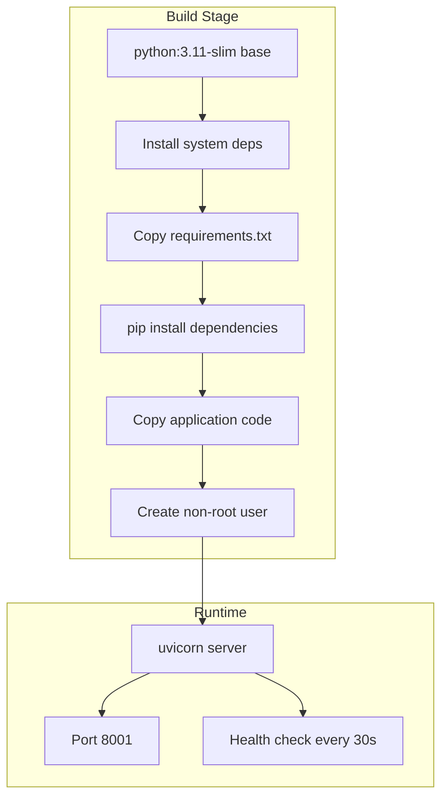
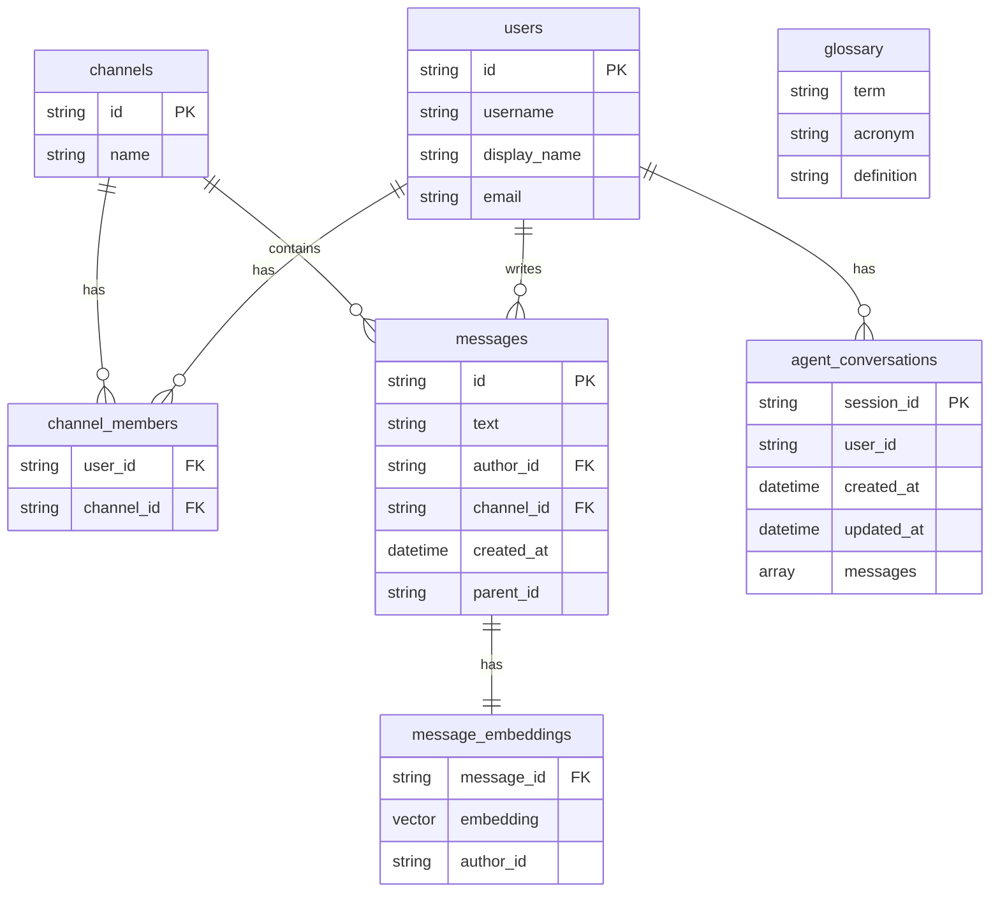

# ConnectBest AI Agent

AI-powered Slack assistant with semantic search, expert finding, jargon explanation, channel summarization, and meeting scheduling capabilities.

## Overview

This is a LangChain-based AI agent that integrates with MongoDB Atlas for data storage and vector search, Groq for LLM inference, Zoom for meeting scheduling, and Gmail for sending invitations.

## Architecture

```mermaid
graph TB
    subgraph Client Layer
        SLACK[Slack App / Web UI]
    end
    
    subgraph AI Agent Service
        subgraph FastAPI
            API[api.py<br/>FastAPI Server<br/>Port 8001]
            CHAT[/chat Endpoint]
            SEARCH[/api/semantic-search]
            HEALTH[/health]
            TOOLS_EP[/tools]
            SESSIONS[/sessions/*]
        end
        
        subgraph Core Module
            AGENT[agent.py<br/>LangGraph Agent]
            MEMORY[MemoryManager<br/>MongoDB Sessions]
            TOOLSM[tools.py<br/>Tool Definitions]
        end
        
        subgraph Tool Implementations
            DATA[data_tools.py<br/>Vector Search & DB]
            JARGON[jargon_tools.py<br/>Glossary Lookup]
            SUMMARY[summarizer_tools.py<br/>Channel Summary]
            MEETING[meeting_tools.py<br/>Zoom + Gmail]
        end
        
        subgraph Infrastructure
            DB[db.py<br/>MongoDB Singleton]
            CONFIG[config.py<br/>Configuration]
        end
    end
    
    subgraph External Services
        MONGO[(MongoDB Atlas<br/>Vector Search)]
        GROQ[Groq API<br/>Llama 4 LLM]
        ZOOM[Zoom API<br/>Meeting Creation]
        GMAIL[Gmail API<br/>Invitations]
        LANGSMITH[LangSmith<br/>Observability]
    end
    
    SLACK -->|POST /chat| CHAT
    SLACK -->|GET /api/semantic-search| SEARCH
    
    API --> AGENT
    AGENT --> MEMORY
    AGENT --> TOOLSM
    AGENT -->|Inference| GROQ
    
    TOOLSM --> DATA
    TOOLSM --> JARGON
    TOOLSM --> SUMMARY
    TOOLSM --> MEETING
    
    DATA --> DB
    JARGON --> DB
    SUMMARY --> DB
    MEETING --> ZOOM
    MEETING --> GMAIL
    
    DB --> MONGO
    AGENT -.->|Tracing| LANGSMITH
    
    style API fill:#2196F3,color:white
    style AGENT fill:#9C27B0,color:white
    style GROQ fill:#FF5722,color:white
    style MONGO fill:#4CAF50,color:white
```

## File Structure

```
app/api/tools/
├── api.py                 # FastAPI application & endpoints
├── Dockerfile             # Production container build
├── docker-compose.yml     # Container orchestration
├── requirements.txt       # Python dependencies
├── README.md              # This file
└── core/
    ├── __init__.py        # Module exports
    ├── agent.py           # LangGraph agent with MongoDB memory
    ├── config.py          # Environment configuration
    ├── db.py              # Thread-safe MongoDB singleton
    ├── tools.py           # LangChain tool definitions
    ├── data_tools.py      # Vector search & database operations
    ├── jargon_tools.py    # Jargon/acronym explanation
    ├── summarizer_tools.py # Channel summarization
    └── meeting_tools.py   # Zoom meeting + Gmail invitations
```

## Core Components

### api.py - FastAPI Application

The main entry point exposing REST endpoints:

| Endpoint | Method | Description |
|----------|--------|-------------|
| `/health` | GET | Health check with tool count |
| `/chat` | POST | Chat with AI agent |
| `/api/semantic-search` | GET | Vector search for messages |
| `/tools` | GET | List available tools |
| `/sessions/{user_id}` | GET | Get user's sessions |
| `/sessions/{session_id}/messages` | GET | Get session messages |
| `/sessions/{session_id}` | DELETE | Delete session |
| `/users/{user_id}/sessions` | DELETE | Clear user history |

### core/agent.py - LangGraph Agent



**Key Features:**
- ReAct agent pattern with tool use
- MongoDB-backed session memory (24h TTL)
- LangSmith integration for observability
- Automatic session management per user

### core/tools.py - Available Tools

| Tool | Description | Parameters |
|------|-------------|------------|
| `semantic_search` | Search Slack messages | `query`, `channel_name?`, `limit?` |
| `find_experts` | Find topic experts | `topic`, `limit?` |
| `explain_jargon` | Explain terms/acronyms | `term` |
| `summarize_channel` | Summarize conversations | `channel_name`, `message_limit?` |
| `schedule_meeting` | Schedule Zoom meeting | `attendees`, `topic?`, `duration_minutes?`, `when?` |
| `find_user` | Look up colleague info | `name` |

### core/data_tools.py - Database Operations



### core/db.py - Database Singleton

Thread-safe singleton managing:
- MongoDB connection with connection pooling
- FastEmbed model (BAAI/bge-small-en-v1.5)
- Graceful initialization and shutdown

### core/meeting_tools.py - Meeting Integration



## API Reference

### POST /chat

Chat with the AI agent.

**Request:**
```json
{
  "message": "Who knows about Kubernetes?",
  "user_id": "user-123",
  "include_history": true
}
```

**Response:**
```json
{
  "response": "Based on message history, here are the top experts on Kubernetes:\n\n1. **Bob Smith** (bob@company.com)...",
  "session_id": "550e8400-e29b-41d4-a716-446655440000",
  "user_id": "user-123",
  "message_count": 4
}
```

### GET /api/semantic-search

Search messages semantically.

**Query Parameters:**
- `q` (required): Search query
- `username` (required): Username for access control
- `limit` (optional): Max results (1-50, default 10)

**Example:**
```bash
curl "http://localhost:8001/api/semantic-search?q=deployment&username=alice&limit=5"
```

### GET /tools

List available agent tools.

**Response:**
```json
{
  "tools": [
    {
      "name": "semantic_search",
      "description": "Search past Slack messages semantically...",
      "parameters": {...}
    }
  ],
  "count": 6
}
```

## Environment Variables

| Variable | Required | Default | Description |
|----------|----------|---------|-------------|
| `MONGO_URI` | Yes | - | MongoDB Atlas connection string |
| `MONGO_DATABASE` | No | `connectbest_chat` | Database name |
| `GROQ_API_KEY` | Yes | - | Groq API key for LLM |
| `GROQ_MODEL` | No | `meta-llama/llama-4-scout-17b-16e-instruct` | LLM model |
| `EMBEDDING_MODEL` | No | `BAAI/bge-small-en-v1.5` | FastEmbed model |
| `LANGSMITH_API_KEY` | No | - | LangSmith for tracing |
| `LANGSMITH_PROJECT` | No | `connectbest-agent` | LangSmith project |
| `ZOOM_CLIENT_ID` | No | - | Zoom Server-to-Server OAuth |
| `ZOOM_CLIENT_SECRET` | No | - | Zoom credentials |
| `ZOOM_ACCOUNT_ID` | No | - | Zoom account ID |
| `GMAIL_CLIENT_ID` | No | - | Gmail OAuth client |
| `GMAIL_CLIENT_SECRET` | No | - | Gmail OAuth secret |
| `GMAIL_REFRESH_TOKEN` | No | - | Gmail refresh token |
| `SENDER_EMAIL` | No | - | Email sender address |

## Running Locally

### Option 1: Python Direct

```bash
# Create virtual environment
python -m venv .venv
source .venv/bin/activate

# Install dependencies
pip install -r requirements.txt

# Set environment variables
export MONGO_URI="mongodb+srv://..."
export GROQ_API_KEY="gsk_..."

# Run server
python api.py
# or
uvicorn api:app --host 0.0.0.0 --port 8001 --reload
```

### Option 2: Docker

```bash
# Build image
docker build -t connectbest-agent .

# Run container
docker run -p 8001:8001 \
  -e MONGO_URI="mongodb+srv://..." \
  -e GROQ_API_KEY="gsk_..." \
  connectbest-agent
```

### Option 3: Docker Compose

```bash
# Set environment variables in .env or export them
docker-compose up --build
```

## Testing

```bash
# Health check
curl http://localhost:8001/health

# Chat
curl -X POST http://localhost:8001/chat \
  -H "Content-Type: application/json" \
  -d '{"user_id": "test-user", "message": "Who knows about Python?"}'

# Semantic search
curl "http://localhost:8001/api/semantic-search?q=python&username=alice"

# List tools
curl http://localhost:8001/tools
```

## Docker Build

The Dockerfile is optimized for production:



**Key optimizations:**
- Uses FastEmbed (no PyTorch, ~100MB smaller)
- Non-root user for security
- Health check with 60s startup period
- Single worker for memory efficiency

## Database Schema



## AWS Deployment

The service is designed for AWS Lightsail Container Service:

1. **ECR**: Push image to AWS ECR
2. **Lightsail**: Deploy container with environment variables
3. **Environment**: All secrets passed at runtime (not baked in image)

```bash
# Build and tag
docker build -t ai-agent .
docker tag ai-agent:latest ${AWS_ACCOUNT_ID}.dkr.ecr.${AWS_REGION}.amazonaws.com/ai-agent:latest

# Push to ECR
aws ecr get-login-password --region ${AWS_REGION} | docker login --username AWS --password-stdin ${AWS_ACCOUNT_ID}.dkr.ecr.${AWS_REGION}.amazonaws.com
docker push ${AWS_ACCOUNT_ID}.dkr.ecr.${AWS_REGION}.amazonaws.com/ai-agent:latest
```

## Observability

### LangSmith Integration

When `LANGSMITH_API_KEY` is set:
- All agent runs are traced
- Tool calls are logged with inputs/outputs
- Session metadata (user_id, session_id) attached
- View traces at: https://smith.langchain.com

### Logging

The application logs:
- Startup status for each component
- Tool execution results
- Error messages with stack traces

## Performance

| Metric | Value |
|--------|-------|
| Startup Time | ~10-15s (model loading) |
| Chat Response | 1-5s (depends on tools called) |
| Semantic Search | 50-100ms |
| Memory per Request | ~50-100MB |
| Container Size | ~1.2GB |

## Troubleshooting

### Common Issues

1. **"MONGO_URI not set"**
   - Ensure environment variable is exported
   - Check for quotes in the connection string

2. **"Failed to load embedding model"**
   - First run downloads the model (~100MB)
   - Check disk space and network

3. **"Zoom credentials not configured"**
   - Set all three: `ZOOM_CLIENT_ID`, `ZOOM_CLIENT_SECRET`, `ZOOM_ACCOUNT_ID`
   - Verify Server-to-Server OAuth app in Zoom marketplace

4. **Session not persisting**
   - Check MongoDB TTL index on `agent_conversations`
   - Sessions expire after 24 hours by design
